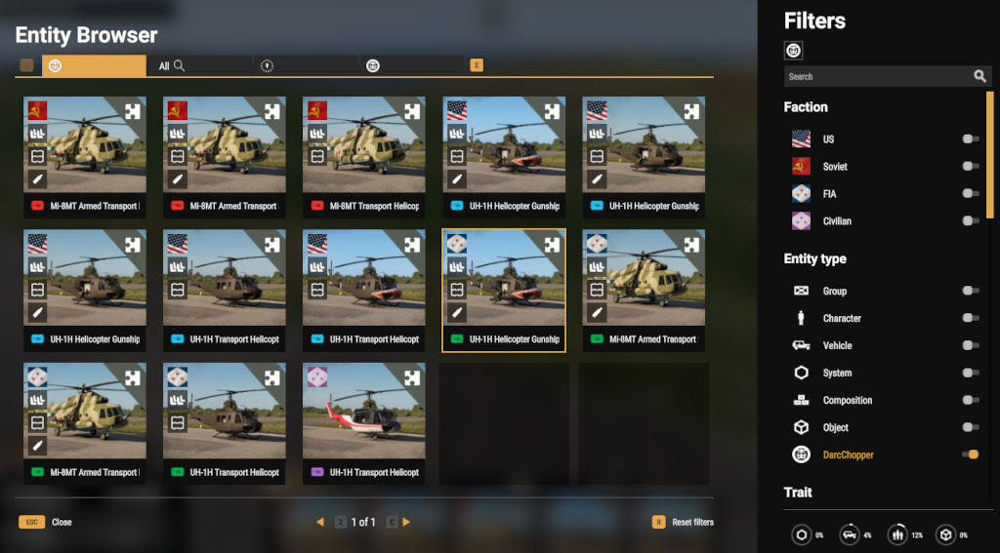
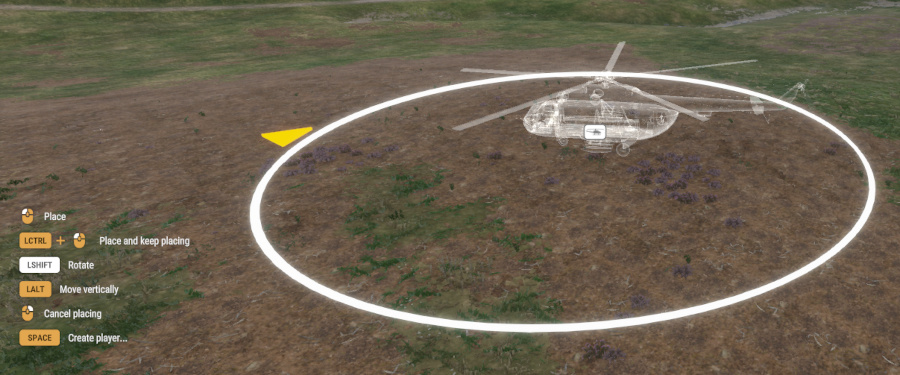
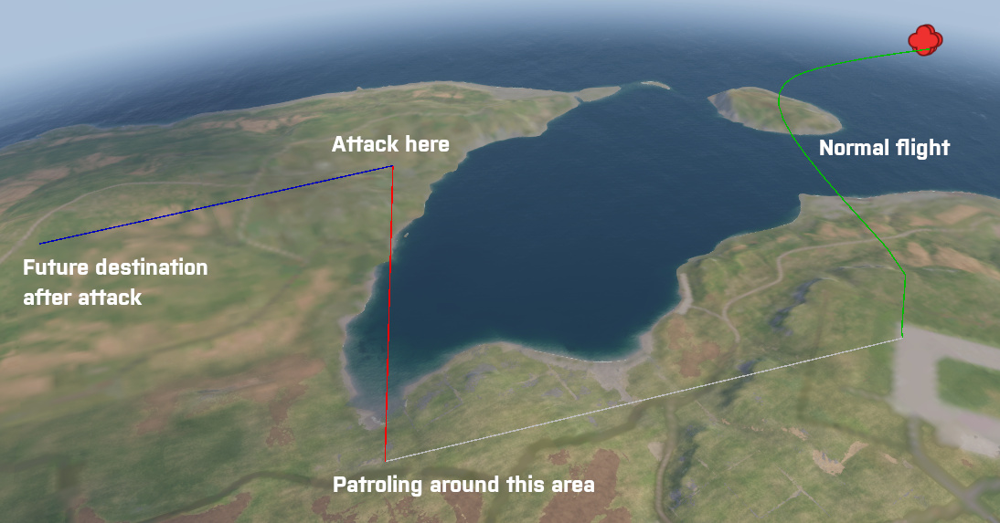
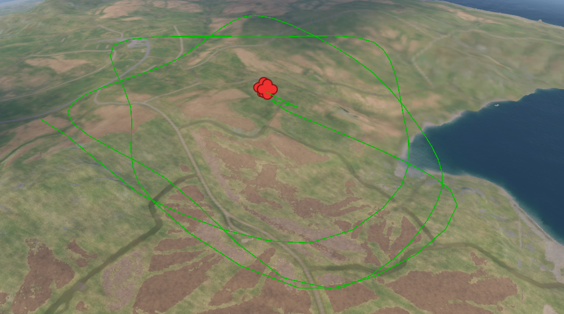
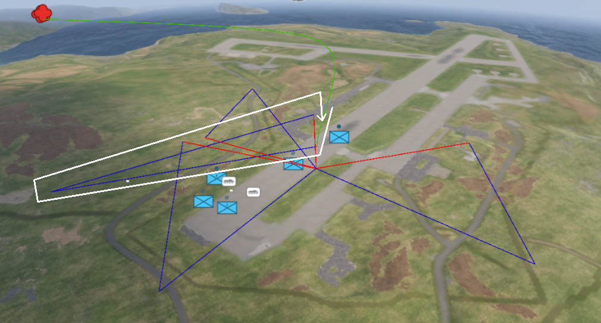
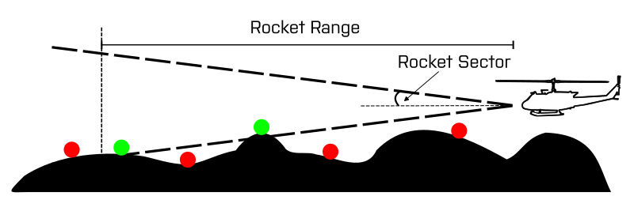

# DarcChopper


The mod introduces functionality to let AIs use helicopters to fly around, attack with guns on the helicopter, use rockets, patrol an area, find enemies, land to bring troops. The mod is still very much WIP.

Functionality is implemented as a single re-usable component. It is very easy to make your favourite modded helicopter to fly by AIs.

Helicopters can be spawned via GM and can be commanded. Currently available waypoints are listed here: [Waypoints](https://github.com/mokdevel/DarcMods/tree/main/DarcChopper#waypoints)

* [Version history](VERSION.md)
* [Creating a flying helicopter](./docs/P_HELICOPTER_FLY.md#creating-a-flying-helicopter)
* [Parameters](./docs/P_HELICOPTER_FLY.md#sdrc_choppercomp-values)

# Re-use in mods and game modes
The flight model is done as a component (SDRC_ChopperComp). You are free to use it in yours - credits are appreciated. In theory you can add that to any helicopter and they will gain autonomous flying capabilities. For a short HowTo, see: [Creating a flying helicopter](./docs/P_HELICOPTER_FLY.md#creating-a-flying-helicopter).

## Modded helicopters
Modded helicopters or helicopters not included in the mod do not work out of the box. You need to add the component (SDRC_ChopperComp) to them and possibly modify some parameters (like ``rotorforceX``). For a short HowTo, see: [Creating a flying helicopter](./docs/P_HELICOPTER_FLY.md#creating-a-flying-helicopter).

## Using in your mod
There are a few public functions that you can use. For flying to destination(s), use ``AddDestination()``. You can call it multiple times to create a fly path. The helicopter will not go exactly to the given point and this is by design. If you want it to fly over a location, set the point behind the location.

# GM Functionality
You can spawn choppers as a GM and they will start to fly around the world randomly. You can control them with waypoints.

## Entity browser
The helicopters piloted by AIs can be found by filtering with DarcChopper. There are variants ready made for faction US, USSR and FIA. Drag and drop in to the world, use ``key: ALT`` to change altitude. Change rotation with ``key: LEFT SHIFT``.



NOTE: You can not set the helicopter on ground and let it lift off and start to fly. This is by design.

## First flight
When spawned, helicopter will check it's altitude to make sure it's above ``Fly Height Low``. If not, the helicopter will be moved and this may look like an ugly jump. Helicopter will start to fly to the direction where the nose is pointing - the yellow arrow in the image. You can use ``key: ALT`` to change altitude and rotate with ``key: LEFT SHIFT``.



## Flight path
A flight path is assigned to the helicopter and it will start to follow it. The flight path is shown with green lines on screen and once reaching the end, a new flight path is created. The flight path will be set between ``Fly Height Low`` and ``Fly Height High`` if the location is on ground or too high up. 

## Lines: Green and Blue
You will see lines of various colors on screen when the helicopter is flying. These will show details of the flight path, but is not exactly what the server sees. The less you have points to follow, the more details the path will show. This is done runtime, so you will see the lines slightly changing their curves while the chopper is flying.

* Green: Shows the flight path for the helicopter. This is a spline that is followed while flying. This shows were we're generally going to end up.
* Blue: If you've set waypoints for the helicopter, blue straight lines will show the future route. When the helicopter reaches the end of a green line, a check for waypoints (blue lines) is made. If waypoints are available, a new route is created via them and you will see the blue straight lines changing to a green flight path.
* Gray: Shows the flight path towards the area to patrol. Once reaching the destination, a patroling flight path will be created.
* Red: Location to attack with rockets. This is more like a bombing run where the target location is shot with rockets regardless of if there are enemies or not.

NOTE: The lines are drawn on a canvas so they will be on top of the screen items. This is something work on and improve.

This is WIP and not optimized at all. I'm not sure what happens if you have 20 choppers flying and all their data is synced while drawing lines on screen.



## Damage and evacuation
If the helicopter receives enough damage, the AI will try to find a safe spot to land the helicopter and disembark. If no safe spot is found, the AI's will fly away from the map.

# Waypoints
You can assign waypoints for the helicopter. Just pick any AI/group or even the helicopter, select a waypoint and drop it on the map. Use ALT-key to change the altitude of the waypoint, but don't worry, if it's on the ground by mistake, it will be set to right flight height. You can set multiple waypoints as a chain and future flight will follow it.

Once a waypoint is dropped, the helicopter will pick it from the map and it will disappear. This means that it has been considered for future use.


Check the supported waypoints below. Other waypoints you define, will disappear from the map and will be discarded.

##  Move 
The helicopter is requested to fly to this destination. You can set multiple ones to create a longer route.

##  Force Move
The helicopter is requested to fly to this destination immediately. Any existing plans will be discarded and the new destination is accepted.

##  Move Relaxed

The helicopter is requested to fly to this destination and do rounds around the area. We will circle around the area for a while until continuing normal flight. You can set multiple points for longer patrol times.

##  Search And Destroy
Search and destroy will order the helicopter to search for enemies close to the location. If an enemy is found, helicopter will change it's route and try to find a good attack route. Once an attack is performed, the area is patroled. This is a repeated action. Currently will stay 10 minutes in the state while doing other actions too.  

##  Suppressive Fire
Suppressive fire will order the helicopter to target a location and bomb it. The area will be shot at regardless of if there are enemies or not. The helicopter needs to be aligned to be able to shoot at the location. Multiple runs towards the target may be performed to the AI with one suppressive fire command. 

##  Artillery Fire
Artillery fire will order the helicopter to target a location and bomb it. This is done ONCE and then we return to normal flying. The area will be shot at regardless of if there are enemies or not. The helicopter needs to be aligned to be able to shoot at the location.


The image shows the green movement to the location to attack. The attack will continue (follow the white line) from another angle. The heli will do a detour and attack along the red line. Rinse and repeat. Once all attacks are performed, normal flying will continue. Wave count, angles and distances are randomized.

##  Get Out
The helicopter will land to the position, order AIs to get out and move 50m from the helicopter. Only passengers (cargo) will be ordered to get out. Pilots and gunners will stay in the chopper. The cargo crew will be split in to groups of four - this was found to be a good solution to have AIs follow get out orders

NOTE: One of the assigned cargo crew will remain in the chopper. This is by design - MI28 AI in the cockpit, mostly refuses to leave when ordered.

In short: Getout will blindly accept the spot you ordered. In the middle forest? You'll probably have a bad time.

This is a macro commmand and does a serie of actions:
```
WP_LAND, to destination
WP_GET_OUT, commands AI to disembark
WP_WAIT, wait for while to AIs time to get out. Time is dependent on crew count in cargo.
WP_HOVER_UP, hover helicopter up to minimum fly height.
WP_RAISE, order helicopter to fly forward for a while.
```
Once actions are done, we return to normal flight mode.

##  Defend (WIP)
The helicopter will find a safe spot where to land near the position where the waypoint was positioned. If no safe area is found, normal flight will continue. Once landed, AIs will be ordered to get out and move 50m from the helicopter. Only passengers (cargo) will be ordered to get out. Pilots and gunners will stay in the chopper. This is an extension to [Get Out waypoint](https://github.com/mokdevel/DarcMods/tree/main/DarcChopper#-get-out).

In short: Defend searches for a safe place to land. This is for modders in case you want to provide e.g. a QRF. You tell where you approx want it and chopper will judge if it's a good idea.

# Configuration parameters
See: [Parameters](./docs/P_HELICOPTER_FLY.md#sdrc_choppercomp-values)

# The flying mechanism
The functionality simulates (=fakes) how an AI would be flying the helicopter. The helicopter is provided with a destination or multiple, and a route is calculated to reach it. Depending on the curvature, distance and various other things, the helicopter is made to behave like it's actually flying.

Arma Reforger physics are used to some extent to modify the speed and how the helicopter descents or climbs. You can modify some of the parameters to simulate for example weight with lower rotor force.

Parameters are used for more natural flying:
- The steeper the turn, the more helicopter roll is affected.
- Pitch is modified depending on the speed.
- Curvature of the flight affects roll but the helicopter tries to return natural flat flying slowly.

## Flight path
The flight path is a spline defined by multiple points (destinations). The helicopter follows it by trying to stay close to it. It's purpose is not to be exact as it's not a train on a track. For example sharp corners will be rounded and additional points are added to make the flight smoother. Sometimes you will see that the destination you want to reach, is not flown through a shortest route. This is by design. AI is making it's own decisions with recommendations coming from you.

## Hills and obstacles
Flying tries to avoid crashing, but unfortunately this sometimes happens. Like humans, AIs make occasionally bad decisions. Some adjustments are done when being too close to a hill: the raise power is increased and speed is decreased. 

NOTE: Currently there is no ray casting involved to find obstacles in front of the helicopter. An obstacle could be a steep hill or another flying helicopter and crashes sometimes happen.

## Destruction
The component is active as long as the helicopter is functional and there is a minimum of one pilot. When the helicopter is deemed non-fuctional, the mod will stop controlling it. Arma Reforger will take control and handle the end of life. The helicopter will fly according to AR physics and this may end up in interesting and funny situations. This is by design.

# AI functionality
A crew is needed for the helicopter to fly.  

## Spawning crew
If the helicopter prefab does not have crew a assigned, the mod will assign crew members. For pilots, members from C_CREW is selected. The rest of the passengers will be from C_RIFLEMAN. See: [EnemyLists](https://github.com/mokdevel/DarcMods/blob/main/DarcMissions/docs/P_LISTS.md#enemy-lists). 

## Factions
The helicopter itself has a faction attached to it. For example MI8's are assigned for USSR faction and the crew is selected from the same faction. Safe factions to use are US, USSR and FIA, but others should work too.

When the helicopter is spawned, the faction is first checked from ``Faction`` setting in the SDRC_ChopperComp. By default the value is empty and the helicopter assigned faction is used. If the parameter is set, the faction is used for crew spawning. If you use [DarcMissions](https://github.com/mokdevel/DarcMods/tree/main/DarcMissions) mod, the faction set as ``enemyFactions`` in it, will be used.

Example: 
* A MI28 (USSR faction helicopter) with FIA setting as faction will spawn with FIA crew.
* A MI28 (USSR faction helicopter) with FIA setting is used in DarcMissions. The ``enemyFactions`` in DarcMissions is set as ``"US", "UK", "UK"``. The helicopter will spawn with 33% US and 66% UK crew.

NOTE: There is no check for correctness currently. So, a faction defined as USRS will result in errors.

## Skill and perception
The skill and perception from Arma Reforger is used for finding enemies. The higher the perception value, the better the AI is able to find its target. A line of sight is needed so you can hide in a building and the AI will not see through walls. The higher the skill, the better the accuracy is.

Skill is define with ``AI Skill`` and percetion by ``AI Perception`` parameters.

## Finding enemies
Perception of the AI affects the capability to find an enemy. This is not controlled by the mod. The mod queries the AIs for knowledge of an enemy. If an enemy is found, the mod keeps this enemy as the high value target (HVT). This can be queried by external mods. After a while, similar query is done and the HVT may change. In case, no enemies are known by the AIs, the helicopter will forget the HVT knowledge.

## Flying
First of all, the AIs do not fly the helicopter. There is no behaviour tree for flying. The pilot AI is a passenger and all the flying magic happen by the component. 

# Shooting
## Machine Guns
AI shooting with MGs is controller by Arma Reforger and not by the mod. If targets are recognized, the AI will shoot by themselves with accuracy defined by the skill.

## Rockets
Arma Reforger does not provide functionality for AIs to use rockets. The mod fakes this by spawning a rocket at ``Rocket Position`` from the helicopter position. The rocket is launched with the capabilities provided by ``MissileMoveComponent``. After this, Arma Reforger handles the physics and related functionality.

Currently the helicopter is not queried for available weapons and their rocket ammo. You need to define the rockets for the helicopter to use in ``Rocket Prefabs``. At startup, one of the prefabs is chosen for use. 

### Shooting at a target
Before a rocket is shot, certain things are checked:
* The target needs to be an enemy of the helicopter. 
* The target has been found. See: [Finding enemies](https://github.com/mokdevel/DarcMods/tree/main/DarcChopper#finding-enemies)
* The found target is within ``Rocket Range``.
* The found target is within ``Rocket Sector``.
* (Future: There is a line of sight to the target)
* The helicopter has rockets available.
If all of the above is true, the helicopter will launch a rocket.



NOTE: Search and Destroy will ignore the targets and shoot at the defined location. This happens even if friendlies are there.

# Known issues
There are various small things that are to be fixed in the future updates:
- Climb in certain cases is too fast and does not look natural.
- Flight path finding is simple for the moment. Steep turns sometimes look nice, sometimes not.
- Some times the helicopter flies nose up after a steep turn. Have not yet found how to avoid that.
- On console(s), the pilots are dock workers. Something to fix at some point.
- Landing has its issues and needs some rework.

# Thanks
- ATiM for Get Out functionality for AI to disembark from the helicopter.

# License
- APL-ND - see: [Licenses](https://www.bohemia.net/community/licenses)
