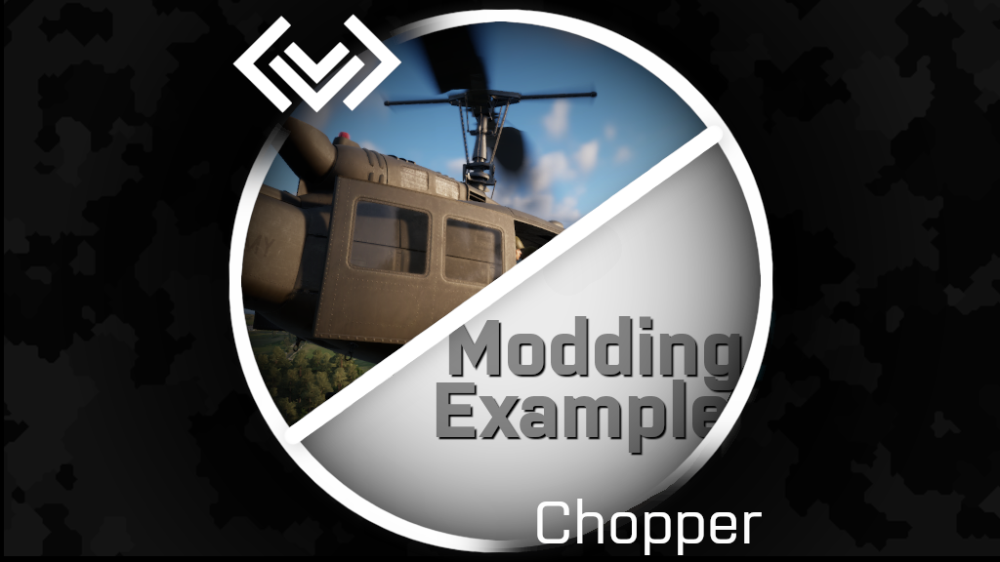

# DarcChopperExample

This mod is a tutorial mod showing how to use DarcChopper in your own mod. This is not to be used in any gaming environments.

DOCUMENTATION IS WIP AND WILL BE EXTENDED LATER.

## HowTo 
Open the ArlandEmpty world provided with the mod and hit run. You will find two choppers doing programmed actions. There are example files named SDRC_ChopperExample_X.c from which you can learn more. More examples to be provided.

# Version history

## 20260829
Main features:
* Added new modding examples to a total of 8.

## 20260410
First release
